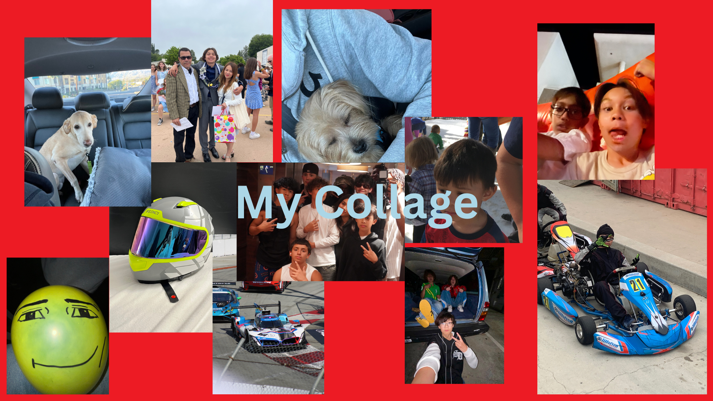

# Intro 

My name is Devin King and I'm in the 10th grade at Chatsworth Charter High School. My favorite movie is Disney Pixar's Cars and that is because I just really like cars in general so obviously im gonna have a interest in the movie but I also love the story.

A fun fact about me is I do karting. Karting is a motorsport like race car driving except instead of a race car, you race in go-karts. I have been going to my local track for about a year and at the time it was really just a hobby but I've actually been pretty good at it so my dad decided to take me to an actual race track and I have been doing practices every few months and I hope to join a championship soon as well as own my own go-kart.

I have two family traditions that pop up in my head immediatley and the first is with my dad as each year we go to the LA auto show which is basically a car show where car manufactures get to show off their latest models and car owners can also show off their cool builds but normally after then we would always go to King Taco. We mainly go anytime we go to some car related event in downtown LA. Another tradition is with my mom where every year we go to Seaworld atleast once or twice and everytime after then we would always end up at Denny's as we would stay until closing and that would be like the only food place open that late at night. A few of my friends have also partcipipated in this tradition as we would bring my friends to these Seaworld trips sometimes.

# My Playlist

[My playlist](https://open.spotify.com/playlist/4pPmJzHDSyQKarFKp2byyn?si=m-0tJ1JeQAemijR4TmZ9Hg&pi=4XZyhUyhSlWtZ)
# My Collage Board

